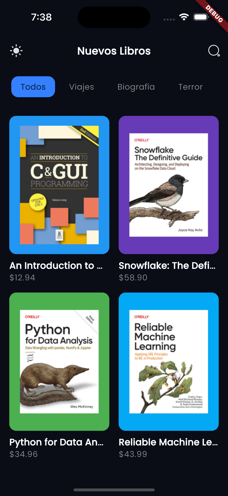
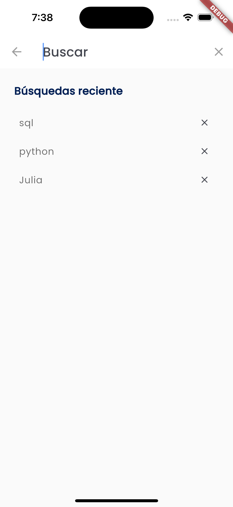
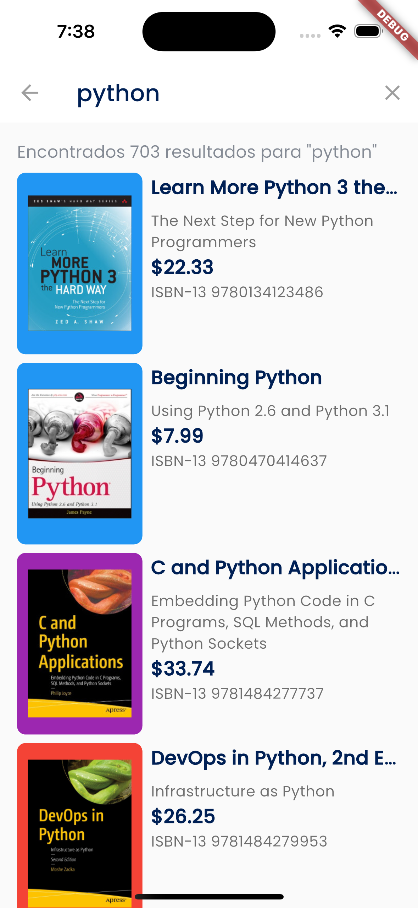
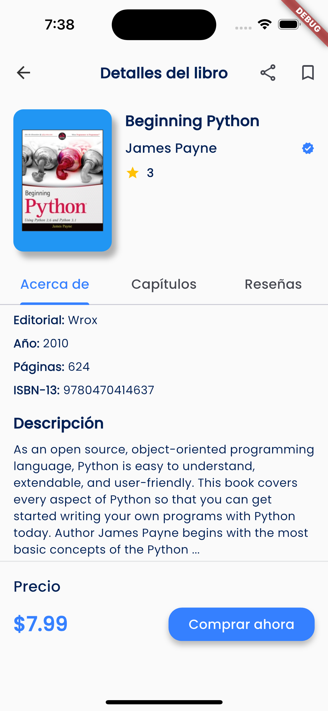
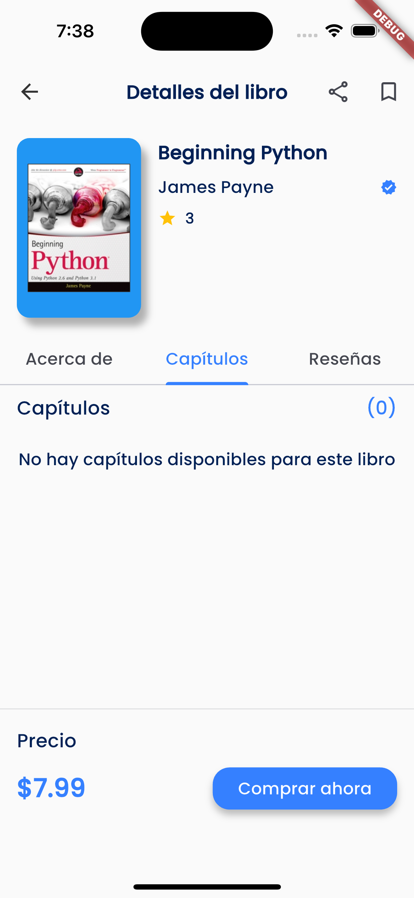
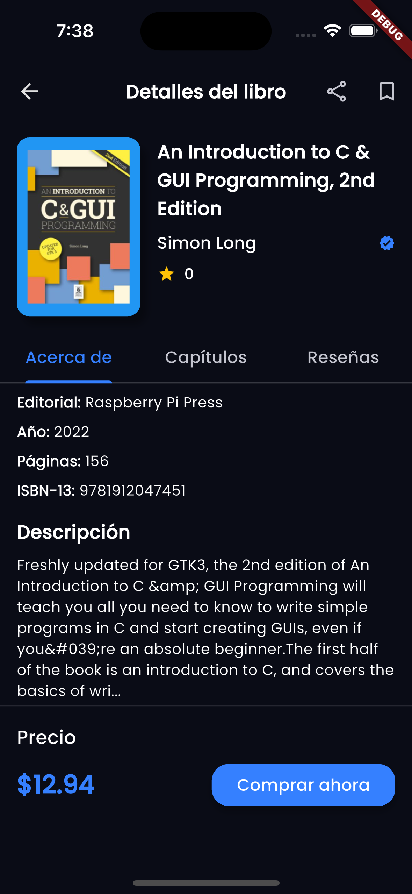

# Colibreria 📚

<p align="center">
    
</p>

<p align="center">
    <a href="#español"></a>
    <a href="#english"></a>
</p>

## Español

### 📱 Descripción del Proyecto

Colibreria es una aplicación móvil desarrollada en Flutter para la Biblioteca de Antioquia que permite a los usuarios buscar libros de tecnología. La aplicación está diseñada siguiendo los principios de Clean Architecture, asegurando código mantenible y escalable.

### ✨ Características Principales

- ✅ **Búsqueda de Libros** - Busca libros por título, autor o palabra clave
- ✅ **Lista de Resultados** - Muestra los libros encontrados en un formato de lista atractivo
- ✅ **Detalle del Libro** - Vista detallada de la información del libro con imagen
- ✅ **Memoria Caché** - Almacenamiento de las últimas 5 búsquedas para consultas más rápidas
- ✅ **Tema Claro/Oscuro** - Soporte para cambio automático de tema basado en la configuración del sistema
- ✅ **Multilingüe** - Soporte para internacionalización
- ✅ **Manejo Óptimo de Errores** - Sistema robusto para capturar y gestionar errores, mejorando la experiencia del usuario con mensajes claros
- ✅ **Pruebas Unitarias**

### 📸 Capturas de Pantalla

<p align="center">
    
    
    
</p>
<p align="center">
    
    
    
</p>

### 🚀 Configuración del Proyecto

#### Prerrequisitos

- Flutter SDK instalado y configurado (versión 3.29.2 del canal estable)
- Git

#### Pasos de Configuración

1. **Clonar el repositorio**

   ```bash
   git clone https://github.com/your-username/colibreria.git
   cd colibreria
   ```

2. **Instalar dependencias**

   ```bash
   flutter pub get
   ```

3. **Configurar variables de entorno**

   - Renombrar el archivo `.env.template` a `.env` en la raíz del proyecto

4. **Ejecutar la aplicación**
   ```bash
   flutter run
   ```

### 📐 Backend Architectured

<p align="center">
    
</p>

La arquitectura sigue los principios de Clean Architecture, dividida en capas:

- **Presentación**: UI, Widgets, Screens y BLoCs
- **Dominio**: Casos de Uso, Entidades y Repositorios Abstractos
- **Datos**: Implementaciones de Repositorios, Fuentes de Datos y Modelos

### 🛠️ Tecnologías Utilizadas

- **Flutter** - Framework de UI multiplataforma
- **Dio** - Cliente HTTP para peticiones API
- **flutter_bloc** - Gestión de estados usando el patrón BLoC
- **hydrated_bloc** - Persistencia de estado para el patrón BLoC
- **go_router** - Navegación y gestión de rutas
- **get_it** - Inyección de dependencias como localizador de servicios
- **equatable** - Comparación de objetos basada en valores
- **cached_network_image** - Carga eficiente y almacenamiento en caché de imágenes
- **flutter_svg** - Manejo de imágenes vectoriales
- **google_fonts** - Tipografía personalizada
- **intl** - Internacionalización
- **logger** - Sistema de registro para depuración
- **path_provider** - Acceso al sistema de archivos del dispositivo
- **share_plus** - Funcionalidad para compartir elementos
- **url_launcher** - Apertura de enlaces externos

### 🧪 Pruebas

Para ejecutar pruebas unitarias:

```bash
flutter test
```

### 📹 Video Demo

[Ver video demo](https://drive.google.com/file/d/1GkWVqDtIKTje87G1Mqdv79-Odfdn5e6i/view?usp=sharing)

## English

### 📱 Project Description

Colibreria is a mobile application developed in Flutter for the Antioquia Library that allows users to search for technology books. The application is designed following Clean Architecture principles, ensuring maintainable and scalable code.

### ✨ Main Features

- ✅ **Book Search** - Search books by title, author, or keyword
- ✅ **Results List** - Displays found books in an attractive list format
- ✅ **Book Detail** - Detailed view of book information with image
- ✅ **Cache Memory** - Storage of the last 5 searches for faster queries
- ✅ **Dark/Light Theme** - Support for automatic theme switching based on system settings
- ✅ **Multilingual** - Support for internationalization
- ✅ **Optimal Error Handling** - Robust system to capture and manage errors, improving the user experience with clear messages
- ✅ **Unit Tests**

### 📸 Screenshots

<p align="center">
    
    
    
</p>
<p align="center">
    
    
    
</p>

### 🚀 Project Setup

#### Prerequisites

- Flutter SDK installed and configured (version 3.29.2 from stable channel)
- Git

#### Setup Steps

1. **Clone the repository**

   ```bash
   git clone https://github.com/your-username/colibreria.git
   cd colibreria
   ```

2. **Install dependencies**

   ```bash
   flutter pub get
   ```

3. **Configure environment variables**

   - Rename the `.env.template` file to `.env` in the project root

4. **Run the application**
   ```bash
   flutter run
   ```

### 📐 Backend Architecture

<p align="center">
    
</p>

The architecture follows Clean Architecture principles, divided into layers:

### 📐 Mobile Architecture

- **Presentation**: UI, Widgets, screens, and BLoCs
- **Domain**: Use Cases, Entities, and Abstract Repositories
- **Data**: Repository implementations, Data Sources, and Models

### 🛠️ Technologies Used

- **Flutter** - Cross-platform UI framework
- **Dio** - HTTP client for API requests
- **flutter_bloc** - State management using BLoC pattern
- **hydrated_bloc** - State persistence for BLoC pattern
- **go_router** - Navigation and route management
- **get_it** - Dependency injection as service locator
- **equatable** - Value-based object comparison
- **cached_network_image** - Efficient loading and caching of images
- **flutter_svg** - Vector image handling
- **google_fonts** - Custom typography
- **intl** - Internationalization
- **logger** - Logging system for debugging
- **path_provider** - Access to device's file system
- **share_plus** - Functionality for sharing elements
- **url_launcher** - Opening external links

### 🧪 Testing

To run unit tests:

```bash
flutter test
```

### 📹 Demo Video

[Watch demo video](https://drive.google.com/file/d/1GkWVqDtIKTje87G1Mqdv79-Odfdn5e6i/view?usp=sharing)
